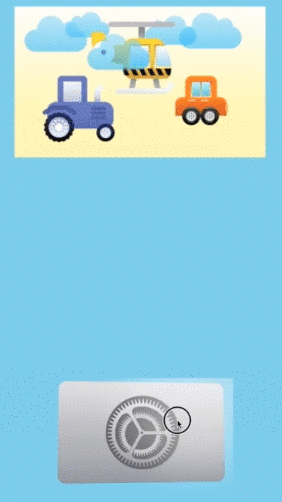
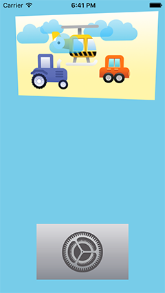
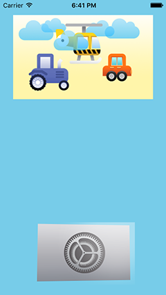

# DRParallaxView 

Multilayer parallax view for iOS (like tvOS app icon)





**Features:**
- multilayer parallax effect with perspective
- reaction on touch
- reaction on gyro motion

##Installation
- Add `DRParallaxView` folder to your project.

##Usage
- Import header file
```objc
#import <DRParallaxView.h>
```

- Init view
```objc
DRParallaxView *drPRView = [[DRParallaxView alloc] initWithFrame:CGRectMake(10, 10, 300, 200)];
[drPRView setLayersWithImages:@[@"0", @"1", @"6", @"2", @"3", @"5"]];
[drPRView setNeedHighlight:false]; // default true
[drPRView setGyroMotion:true]; // default false
[self.view addSubview:drPRView];
```

##Todo
- UIButton category
